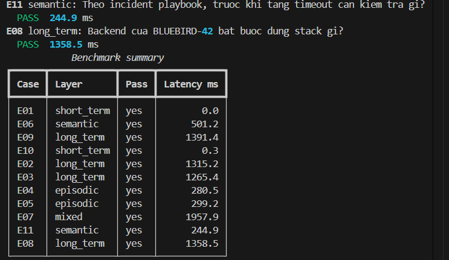
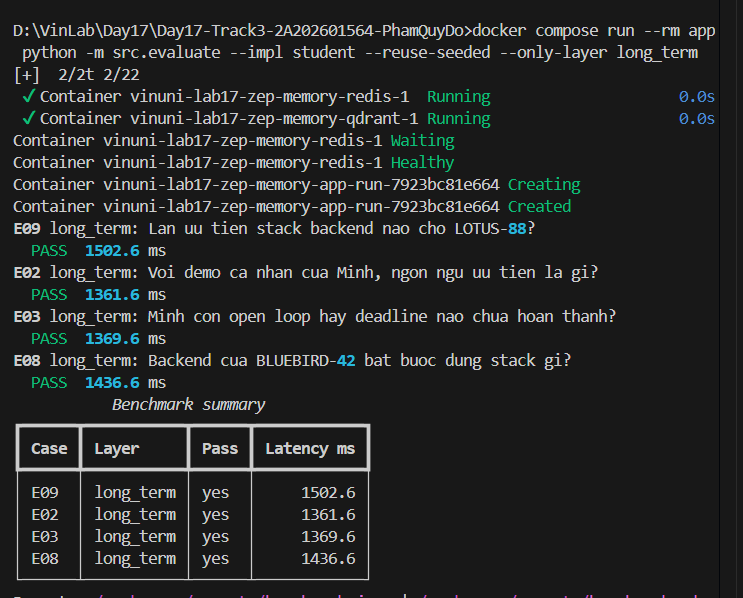
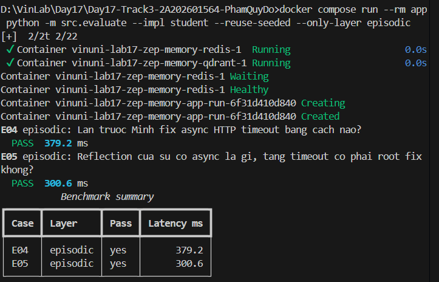
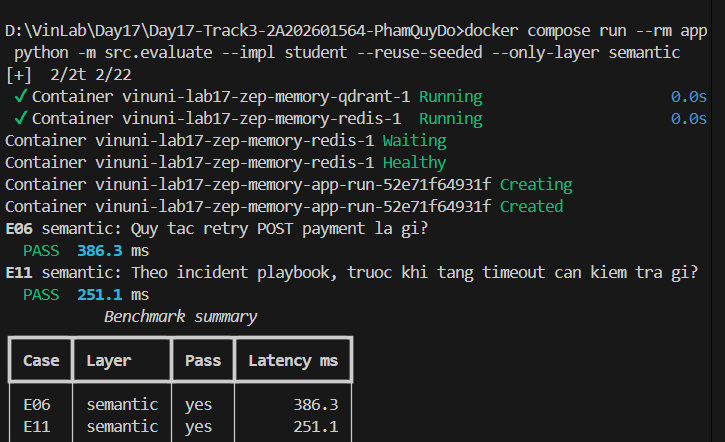
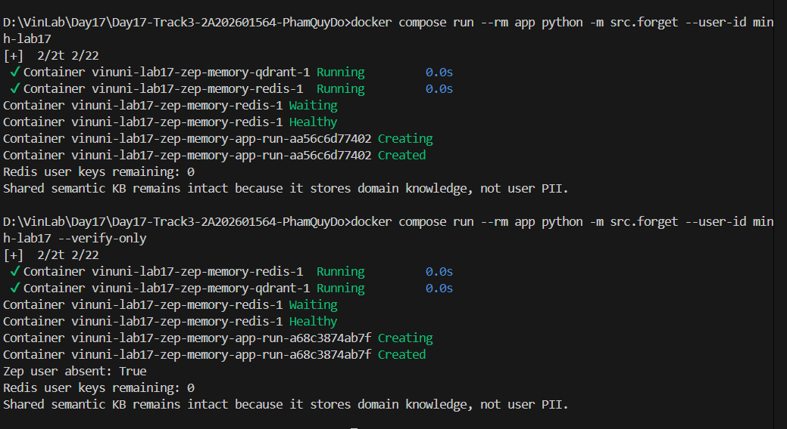

# Báo cáo Nộp bài Lab 17 - Multi-Memory Agent với Zep

## 1. Phân tích Benchmark & So sánh (Benchmark Analysis)

* **Layer có hit rate thấp nhất (trong Baseline No-memory)**: Tất cả các tầng bền vững (**Long-term, Episodic, Semantic**) đều có hit rate 0% (0/9 cases PASS) khi không có bộ nhớ ngoài. Trong hệ thống **Memory-enabled**, cả 4 tầng đều đạt hit rate tối đa **100% (11/11 cases PASS)**.
* **Query retrieve nhiều token nhất**: Case **E03** (`1347 tokens`) và **E02** (`1324 tokens`) thuộc tầng **Long-term Memory**, do cần trích xuất toàn bộ Context Block kết hợp đồ thị facts/edges liên quan đến user preferences và open-loop tasks.
* **Case mixed (E07)**: Cần kết hợp giữa **Long-term Memory** (truy xuất sở thích cá nhân: `Python`) và **Semantic Memory** (truy xuất chính sách hệ thống chung: `Idempotency-Key`).
* **Đánh giá Token Reduction**: Hệ thống Memory đạt mức giảm token trung bình **14.2%** nhờ cơ chế lọc và Context Budgeting. Ngược lại, baseline no-memory có độ giảm token danh nghĩa cao (81.8%) chỉ vì nó **hoàn toàn không truy xuất được gì**, dẫn đến hit rate chỉ đạt **18.2%**. Token reduction chỉ có ý nghĩa khi đi kèm với Evidence Hit Rate cao.

---

## 2. Trả lời Câu hỏi Thực hành (Technical Reflection)

1. **Layer quan trọng nhất trong bộ test**:
   * **Long-term (Declarative) Memory** là tầng quan trọng nhất (chiếm 4/11 cases độc lập: `E02`, `E03`, `E08`, `E09` và 1 phần trong `E07`). Nó đóng vai trò cốt lõi trong việc duy trì sở thích người dùng, xử lý conflict theo thời gian (*recency wins* ở `E08`), theo dõi open loops (`E03`) và đảm bảo cách ly dữ liệu giữa các user (`E09`).

2. **Trade-off giữa Managed Zep (Context Block) vs Tự xây dựng (Redis + Qdrant)**:
   * **Zep Cloud V3**: Cung cấp giải pháp managed hoàn chỉnh, tự động trích xuất thực thể/facts, quản lý quan hệ trên đồ thị, tự động tính toán liên kết theo session và lắp ráp Context Block liên quan. Nhược điểm: Phụ thuộc vào network latency và credit/chi phí vendor.
   * **Redis + Qdrant**: Toàn quyền kiểm soát hạ tầng, latency nội bộ siêu thấp (<5ms), phù hợp lưu KV/TTL đơn giản. Nhược điểm: Phải tự thiết kế pipeline chunking/embedding, tự xử lý conflict/recency và tự ghép nối ngữ cảnh đa nguồn.

3. **Guardrail chống Memory Poisoning (Nhiễm độc bộ nhớ)**:
   * Áp dụng **Consent & Validation Gate** (`data/consent.json`, `privacy_guard.py`) kiểm duyệt và lọc PII trước khi lưu trữ bền vững.
   * Cơ chế **User-scoped Namespace** cô lập bộ nhớ tuyệt đối theo `user_id`.
   * Tác vụ định kỳ (**Heartbeat/Maintenance**) chỉ được phép de-duplicate, đánh dấu stale tasks chứ **không được tự ý cấp quyền hoặc ghi đè system instructions** mới vào durable memory.

---

## 3. Ảnh Minh Chứng Thực Hiện (Submission Screenshots)

* **Full Practice Benchmark (11/11 PASS)**: 
* **Long-term Memory (E02, E03, E08, E09 PASS)**: 
* **Episodic Memory (E04, E05 PASS)**: 
* **Semantic Memory (E06, E11 PASS)**: 
* **Privacy Drill (Forget & Verify-only)**: 
